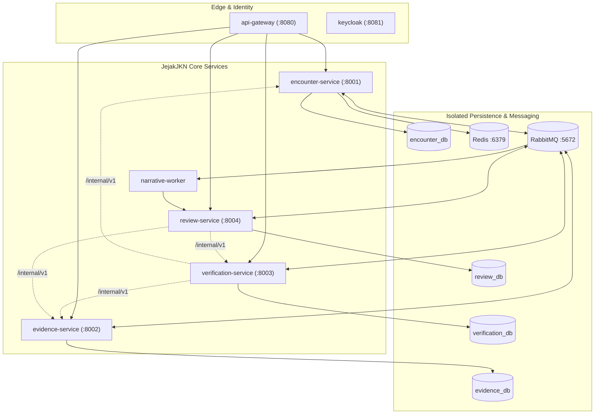

# C4_CONTAINERS_TOPOLOGY :: v1.0

```mermaid
flowchart TB
  subgraph EDGE_LAYER["Edge & Identity"]
    GW["api-gateway (:8080)"]
    KC["keycloak (:8081)"]
  end

  subgraph CORE_SERVICES["JejakJKN Core Services"]
    ENC["encounter-service (:8001)"]
    EVD["evidence-service (:8002)"]
    VER["verification-service (:8003)"]
    REV["review-service (:8004)"]
    NAR["narrative-worker"]
  end

  subgraph DATA_STORES["Isolated Persistence & Messaging"]
    PG_ENC[("encounter_db")]
    PG_EVD[("evidence_db")]
    PG_VER[("verification_db")]
    PG_REV[("review_db")]
    REDIS[("Redis :6379")]
    RMQ[("RabbitMQ :5672")]
  end

  GW --> ENC & EVD & VER & REV
  ENC --> PG_ENC
  ENC --> REDIS
  EVD --> PG_EVD
  VER --> PG_VER
  REV --> PG_REV
  ENC & EVD & VER & REV <--> RMQ
  RMQ --> NAR
  NAR --> REV
  VER -. "/internal/v1" .-> ENC & EVD
  REV -. "/internal/v1" .-> VER & EVD
```
